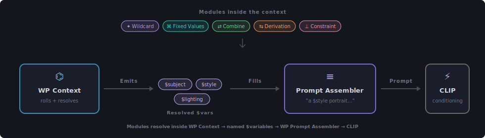
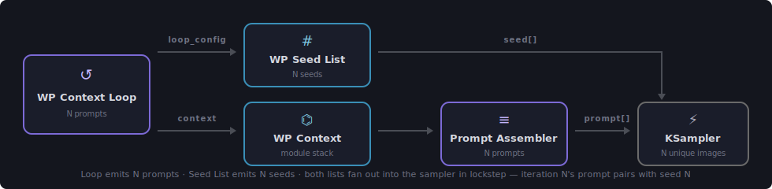
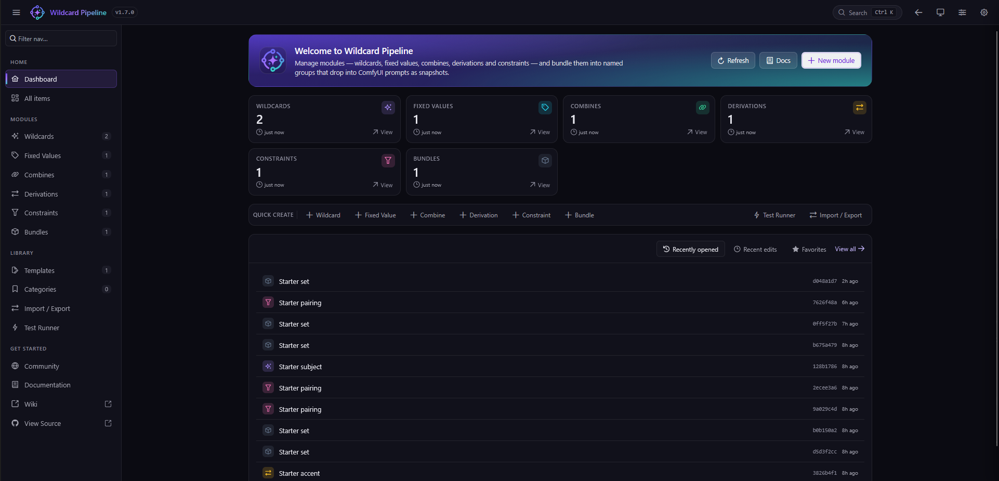

<h1 align="center">
  
  &nbsp;Wildcard Pipeline
</h1>

<p align="center">
  <em>Modular procedural prompt generation for ComfyUI — wildcards, constraints, derivations, loops, and a persistent module library.</em>
</p>

<p align="center">
  <a href="https://github.com/DumiFlex/ComfyUI-Wildcard-Pipeline/actions"></a>
  <a href="https://github.com/DumiFlex/ComfyUI-Wildcard-Pipeline/releases"></a>
  <a href="https://github.com/DumiFlex/ComfyUI-Wildcard-Pipeline/blob/main/LICENSE"></a>
  <a href="https://github.com/DumiFlex/ComfyUI-Wildcard-Pipeline/wiki"></a>
  <a href="https://discord.gg/BFYR9WQdVR"></a>
</p>

<p align="center">
  
</p>

## What it does

Stock ComfyUI prompt nodes either take a single literal string or pick from a flat wildcard file. **Wildcard Pipeline** lets each module read what the previous modules picked — so `$mood` reacts to `$weather` via a constraint, a `combine` interpolates `$style $subject` into `$scene`, a derivation flips `$accent` based on `$mood`, and your final prompt is a coherent multi-element composition instead of a Frankenstein concatenation.

**One Generate. One coherent prompt. Re-roll until you stop laughing.**

## Highlights

- **Module stack inside a Context node** — drop in `wildcard`, `fixed_values`, `combine`, `derivation`, `constraint`, `bundle` modules and they each publish a `$variable` to the chain.
- **Constraints with carriers** — re-weight downstream wildcards based on what upstream picked. Matrix + per-option exceptions. Carrier-via-nested-ref so a constraint can reach a wildcard nested inside another wildcard's option.
- **Loops + per-iteration seeds** — `WP Context Loop` runs your whole chain N times from a single Generate; `WP Seed List` pairs N unique sampler seeds with the N prompts so every output is distinct.
- **Persistent library** — a manager SPA backed by SQLite stores reusable modules, frozen bundles, prompt templates, and a category tree. Browse / edit / fork / push from the canvas.
- **Inspector** — `WP Debug` shows the post-run snapshot, per-module trace, per-wildcard picks, and the conflict-scanner warnings.
- **Type-coercion helpers** — `WP Var → Int / Float / Bool` parse typed values out of any `$variable` so wildcards can drive image width, step count, sampler cfg, conditional switches.

## Installation

### ComfyUI Manager (recommended)

1. Open the **ComfyUI Manager** in your browser.
2. Search for **Wildcard Pipeline** by **dumiflex**.
3. Click **Install** and restart ComfyUI.

### Manual installation

1. Navigate to your ComfyUI `custom_nodes` directory.
2. Clone the repository:

   ```bash
   git clone https://github.com/DumiFlex/ComfyUI-Wildcard-Pipeline
   ```

3. Install the Python dependencies:

   ```bash
   pip install -e .
   ```

4. Build the frontend assets (requires Node.js and pnpm):

   ```bash
   pnpm install
   pnpm run build
   ```

5. Restart ComfyUI.

## Quick start

1. Open the Wildcard Pipeline manager (sidebar → **Wildcards** → **+ New**). Name `subject`, variable binding `$subject`, three options: `a cat`, `a dog`, `a fox` at weight 1 each. Save.
2. On the canvas, drop `WP Context` → `WP Prompt Assembler` → `CLIP Text Encode` → `KSampler`. Add your wildcard to the context. Type `a $subject` into the assembler template. Queue.

Each Generate rolls a fresh subject. Full walkthrough: [Quick Start wiki page](https://github.com/DumiFlex/ComfyUI-Wildcard-Pipeline/wiki/Quick-Start).

## The nodes

| Node | What it does |
|---|---|
| `WP Context` | Holds a module stack, emits a resolved `$variable` context. |
| `WP Context Loop` | Runs the downstream chain N times in one click; emits per-iteration `$iteration` + `$iteration_total`. |
| `WP Context Injector` | Lifts any ComfyUI node output (multiline String, INT, etc.) into a named `$variable`. |
| `WP Seed List` | Emits a list of N derived seeds — one per loop iteration — so every (prompt, seed) pair is unique. |
| `WP Prompt Assembler` | Fills `$var` placeholders in a template string. Supports `{a\|b\|c}` inline picks + missing-var detection. |
| `WP Prompt Cleaner` | Rule-based prompt cleanup: whitespace, punctuation, exact + fuzzy dedupe, blocklist. |
| `WP Debug` | Read-only inspector — Snapshot / Trace / Picks / Warnings tabs. |
| `WP Var → Int / Float / Bool` | Parse typed values out of any `$variable` to drive ComfyUI INT / FLOAT / BOOLEAN inputs. |

Full node reference: [Nodes wiki page](https://github.com/DumiFlex/ComfyUI-Wildcard-Pipeline/wiki/Nodes).

## The modules

| Module | Writes | Role |
|---|---|---|
| **Wildcard** | `$<name>` | Weighted random pick from a pool. The core building block. |
| **Fixed Values** | `$<name>` (× N) | Static `name → value` bindings — style, quality boosters, negative-prompt fragments. |
| **Combine** | `$<name>` | Templated string that interpolates earlier `$vars` into a single output `$var`. |
| **Derivation** | `$<name>` | IF / ELIF / ELSE rules that read picked `$vars` and rewrite others. |
| **Constraint** | *(none)* | One-shot re-weight of a downstream wildcard's pool based on an upstream pick. |
| **Bundle** | *(group)* | Frozen group of modules — drop into any Context as a reusable unit. |
| **Template** | *(asm side)* | Saved Prompt Assembler template string in the library. |

Full module reference: [Modules wiki page](https://github.com/DumiFlex/ComfyUI-Wildcard-Pipeline/wiki/Modules).

## Looping a chain — one click, N coherent prompts

<p align="center">
  
</p>

Drop `WP Context Loop` before your `WP Context` and pair it with `WP Seed List` for distinct sampler seeds. Both lists fan out in lockstep so iteration N's prompt always pairs with seed N. Each iteration carries its own `$iteration` / `$iteration_total` for in-template labelling (`frame 1 of 4 — a fox`). See [Concepts → Seeds and loops](https://github.com/DumiFlex/ComfyUI-Wildcard-Pipeline/wiki/Concepts#seeds-and-loops).

## The manager (SPA)

A dedicated single-page app for browsing + editing the library. Open it from the ComfyUI sidebar.

<p align="center">
  
</p>

- **Library** — wildcards / fixed values / combines / derivations / constraints / bundles / templates / categories. Filter, search, bulk-tag, favorite.
- **Test Runner** — resolve any module against the engine N times and inspect per-rule fire rates / per-option pick rates.
- **Import / Export** — versioned JSON exports with conflict resolution (rename / overwrite / skip per row).
- **Cascade impact dialog** — deleting a module shows you every bundle + constraint + combine that references it before you confirm.
- **Documentation tab** — full in-app docs covering every node + module + concept, with worked examples.

## Inspecting a run

Wire a `WP Debug` node off any Context output. After Generate it fills with a tabbed snapshot of what flowed through that point:

- **Snapshot** — final `$variable → value` map.
- **Trace** — per-module execution log: what each ran, what it wrote, where the seed came from.
- **Picks** — which wildcard option was picked, its weight, its sub-category.
- **Warnings** — runtime warnings (constraint never fired, missing variable, etc.).

See [Nodes → WP Debug](https://github.com/DumiFlex/ComfyUI-Wildcard-Pipeline/wiki/Nodes#wp-debug).

## Documentation

- 📖 **[GitHub Wiki](https://github.com/DumiFlex/ComfyUI-Wildcard-Pipeline/wiki)** — Home / Quick Start / Nodes / Modules / Concepts
- 🖥️ **In-app docs** — sidebar → Documentation tab inside the manager SPA (every concept, every module, every node, with worked examples)
- 💬 **[Discord](https://discord.gg/BFYR9WQdVR)** — chat, show-and-tell, fastest path to a response
- 💭 **[GitHub Discussions](https://github.com/DumiFlex/ComfyUI-Wildcard-Pipeline/discussions)** — long-form questions, ideas, design threads
- 🐛 **[Issue tracker](https://github.com/DumiFlex/ComfyUI-Wildcard-Pipeline/issues)** — bug reports + feature requests

## Status

Active development. Versioned releases with [semantic-release](https://github.com/semantic-release/semantic-release) — every merged commit on `main` either ships a release or stays as `next` until the next breaking / feature change rolls one. Bundle-size + test gates run on every PR.

## Contributing

PRs welcome. See [CONTRIBUTING.md](./.github/CONTRIBUTING.md) for the dev loop (`pnpm install` → `pnpm dev` for the extension watcher, `pnpm test` for vitest, `pytest` for the engine, `ruff check .` for lint).

## License

[GPL-3.0-or-later](./LICENSE). Free to use, modify, fork. If you ship modifications, ship the source too.
