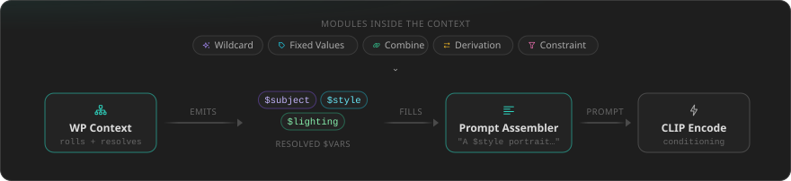
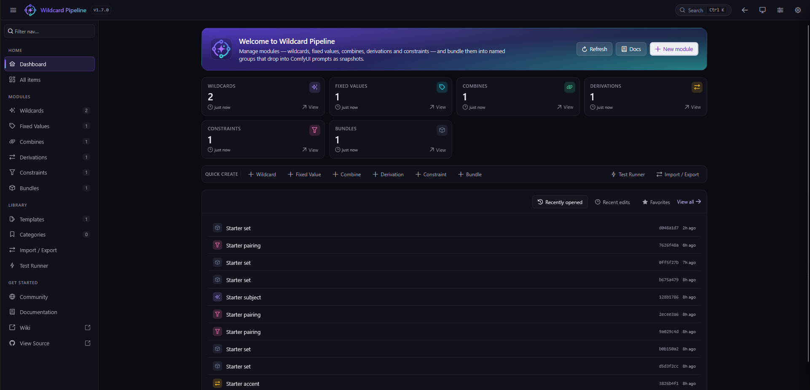

<h1 align="center">
  
  &nbsp;Wildcard Pipeline
</h1>

<p align="center">
  <em>Random prompts for ComfyUI that actually make sense together.</em>
</p>

<p align="center">
  <a href="https://github.com/DumiFlex/ComfyUI-Wildcard-Pipeline/actions"></a>
  <a href="https://github.com/DumiFlex/ComfyUI-Wildcard-Pipeline/releases"></a>
  <a href="https://github.com/DumiFlex/ComfyUI-Wildcard-Pipeline/blob/main/LICENSE"></a>
  <a href="https://github.com/DumiFlex/ComfyUI-Wildcard-Pipeline/wiki"></a>
  <a href="https://discord.gg/BFYR9WQdVR"></a>
  <a href="https://wp.dumiflex.dev"></a>
</p>

<p align="center">
  
</p>

Plain wildcards pick every part of a prompt on its own, so you get a snowy beach
at noon under the stars. Wildcard Pipeline builds the prompt step by step, and
each step can see what the earlier ones picked. If the weather comes out as rain,
the mood can lean gloomy and the lighting can follow. Every Generate gives you a
fresh prompt that still hangs together.

## Install

- **ComfyUI Manager (recommended):** search for **Wildcard Pipeline** by
  **dumiflex**, click **Install** and restart ComfyUI.
- **By hand:** download the zip from the
  [latest release](https://github.com/DumiFlex/ComfyUI-Wildcard-Pipeline/releases/latest),
  unzip it into `ComfyUI/custom_nodes/` and restart ComfyUI.

<details>
<summary>Installing from source</summary>

A git clone has no built frontend, so you need Node.js and pnpm:

```bash
cd ComfyUI/custom_nodes
git clone https://github.com/DumiFlex/ComfyUI-Wildcard-Pipeline
cd ComfyUI-Wildcard-Pipeline
pnpm install
pnpm build
```

</details>

## Quick start

1. Open the **Wildcard Pipeline** manager from the ComfyUI sidebar and create a
   wildcard called `subject` with three options: `a cat`, `a dog`, `a fox`.
2. On the canvas, chain **WP Context** → **WP Prompt Assembler** →
   **CLIP Text Encode**. Add your wildcard to the Context node and type
   `a photo of $subject` into the Assembler.
3. Queue a few times. Each run picks a new subject.

The [Quick Start wiki page](https://github.com/DumiFlex/ComfyUI-Wildcard-Pipeline/wiki/Quick-Start)
walks through a fuller example.

## How it works

You stack **modules** inside a **WP Context** node. Each module sets one or more
`$variables`, and the **WP Prompt Assembler** drops them into your template.

| Module | What it does |
|---|---|
| **Wildcard** | Picks one option from a weighted list. |
| **Fixed Values** | Sets variables to values you choose, like a style or quality tags. |
| **Combine** | Builds one variable out of others, e.g. `$style $subject`. |
| **Derivation** | If/else rules: "if `$weather` is rain AND `$time` is night, set `$lighting` to neon". Conditions can be grouped with AND / OR. |
| **Constraint** | Makes an earlier pick change the odds of a later one, or rule options out entirely. |
| **Bundle** | A saved group of modules you can drop in as one piece. |

Options can point at other modules with `@name`, so a wildcard can nest another
one. If the module you want doesn't exist yet, pick **Placeholder** from the `@`
list and connect it later.

### Nodes

| Node | What it does |
|---|---|
| **WP Context** | Holds your module stack and outputs the picked variables. Chain several together. |
| **WP Prompt Assembler** | Fills `$variables` in a template. Also supports inline `{a\|b\|c}` picks. |
| **WP Context Loop** + **WP Seed List** | Run the whole chain N times from one Generate, each with its own prompt and seed. |
| **WP Context Injector** | Turns any ComfyUI output (text, a number) into a `$variable`. |
| **WP Prompt Cleaner** | Tidies the final prompt: spacing, stray commas, duplicates, a blocklist. |
| **WP Debug** | Shows what happened during a run (see below). |
| **WP Var → Int / Float / Bool** | Use a variable to drive a number or switch, like image size or steps. |

Most nodes have a help page in ComfyUI's node info panel, and the
[wiki](https://github.com/DumiFlex/ComfyUI-Wildcard-Pipeline/wiki) covers
[nodes](https://github.com/DumiFlex/ComfyUI-Wildcard-Pipeline/wiki/Nodes),
[modules](https://github.com/DumiFlex/ComfyUI-Wildcard-Pipeline/wiki/Modules) and
[concepts](https://github.com/DumiFlex/ComfyUI-Wildcard-Pipeline/wiki/Concepts)
in depth.

## The manager

Open it from the ComfyUI sidebar. It's where your modules live between workflows.

<p align="center">
  
</p>

- **Library:** create, edit and search your modules, bundles and prompt
  templates. The **Tags** page groups them into collections, and you can rename
  or merge a tag across the whole library.
- **Test Runner:** try a set of modules over many seeds without generating
  images. See how often each option comes up and which rules fired, save a
  baseline, and after an edit see exactly which outputs changed.
- **Community:** browse and install modules other people have shared on the
  [community site](https://wp.dumiflex.dev), and publish your own.
- **Import / Export:** move modules between machines as JSON files.
- **Documentation:** the full guide, built into the app.

## Checking a run

Connect **WP Debug** to a Context node and generate. It shows:

- **Variables:** every value, and which step set it.
- **Trace:** each step, and why it did what it did: which derivation rule fired,
  a wildcard's odds and what re-weighted them, where a nested pick came from.
- **Warnings:** anything that went wrong, linked to the step that caused it.
- **Raw:** the underlying data, for bug reports.

## Help and sharing

[Discord](https://discord.gg/BFYR9WQdVR) is the place for all of it: there are
channels for questions, bug reports, feature requests and showing what you made.
You can also report bugs on [GitHub Issues](https://github.com/DumiFlex/ComfyUI-Wildcard-Pipeline/issues).

Made something you like? Post your images and workflows on Discord, and publish
your modules on the [community site](https://wp.dumiflex.dev) so others can
install them from the manager's **Community** page.

## Privacy

Everything runs locally. The extension only goes online to check for updates
(you can turn this off in Settings), when you open the Community page, or when
you choose to download the optional tag list for autocomplete. Details are in
[docs/network-access.md](docs/network-access.md).

## Contributing

PRs are welcome. [CONTRIBUTING.md](.github/CONTRIBUTING.md) explains the dev setup.

## License

[GPL-3.0-or-later](LICENSE)
