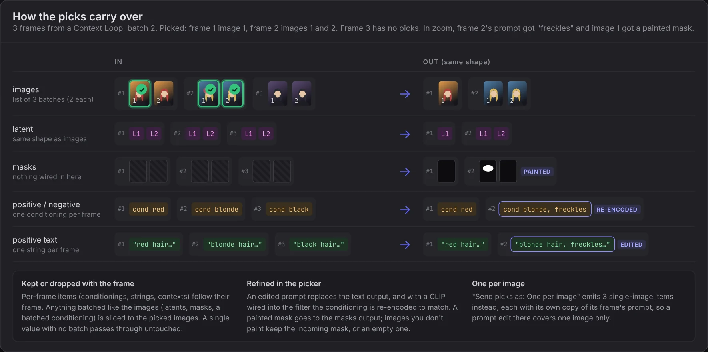

# WP Image Filter

Pauses the run so you can pick which images go on. Everything that belongs to an image (its latent, masks, conditioning, prompt text and Context) is filtered with it, so the node can sit between the first KSampler and the upscaler and the upscaler only gets the picked images with their own prompts.

## Inputs and outputs

Every input has a matching output. Connect only what you need.

- **images**: the images to pick from. Required; this is what the picker shows.
- **latent**, **masks**: sliced to the picked images. A mask you paint in the picker replaces that image's mask.
- **positive**, **negative**: CONDITIONING. A batched conditioning is sliced with the images; a single one is kept for each frame that keeps any image.
- **positive_text**, **negative_text**: the prompt strings, kept or dropped with their frame.
- **context**: the WP Context of each frame, kept or dropped with it.
- **clip** (input only, optional): re-encodes a prompt you edit in the picker, so the positive/negative conditioning follows the edit. Without it an edit changes only the text outputs.
- **extra_1**, **extra_2**: any type. The output takes the type of what you connect. Batched values are sliced; anything else follows its frame.
- **picks** (output only): what was kept, as `frame:image` (1-based), for example `1:2, 3:1`.

A Context Loop (or any list) makes one **frame** per iteration. Lists line up by frame; a shorter list repeats its last item.

## The picker

- Click an image to pick it. Ctrl+A picks everything; a frame with several images has an **all** button that picks the frame.
- Click the frame around an image (its border or its label) to zoom in, where you can compare, edit the prompt and paint a mask. **Zoom & refine** in the header, or **Space**, opens and leaves the zoom too (Space zooms the image under the mouse). In the zoom, ←/→ move and ↑ picks. The picker remembers: leave it zoomed and the next one opens zoomed.
- **I** or **Details** (in the zoom) adds a Details panel for power users: the frame's variable values (swept ones first, in their grid colour; **Copy** copies them), its seed, the other images of the frame with **Pick whole frame**, and the positive prompt with each value marked where it landed (click it to edit). Everything else in the zoom still works, and the picker remembers whether Details was on.
- **C** (in the zoom) pins the image; step to another and a slider compares the two. **C** again stops.
- **Fit** (or **F**) in the header makes the images as big as the picker allows, so a handful of images fill the screen. The picker remembers it.
- **Enter** or **Keep N picked** sends the picks on. **Keep all** sends everything. **Stop branch** stops the nodes after this one; the rest of the run finishes normally.
- A short chime plays when the picker opens, and the tab title starts with **● Pick images** while something waits. Turn the chime off under **Settings → Wildcard Pipeline → Runtime behavior → Image Filter sound**. Turn on **Image Filter desktop notification** there to also get a system notification while the tab is in the background.
- **Escape** or the − button tucks the picker away. A "waiting" pill stays at the bottom of the screen and reopens it with your picks still there.

## Labels, sweep grid and Send to Loop

- With a Context Loop, each frame is labelled with its number and the options its sweep pinned, for example `#3 · red · pencil`. Hover a label for the frame's seed and prompt.
- A sweep of two or more wildcards opens as a **grid**. The bar above it picks which wildcard goes on **Rows** and which on **Columns** (⇄ swaps them); any others **Split by**, one small grid per value. Click a row, column or group name to pick all of it. **Frames** in the header switches back to the list.
- **Send to Loop** writes your picks back to the loop: picked frames get their seeds locked (when the loop overrides seeds) and every other frame is bypassed, so the next run repeats only what you kept.

## Refine before it goes on

In the zoom, the **Refine** panel edits the frame's prompts and paints a mask for the upscaler. Tiles show ✎ for an edited prompt and ◐ for a painted mask.

- An edited prompt replaces the text output. With a CLIP wired into **clip**, the conditioning is re-encoded to match; without one it stays as it was, and the panel says so.
- With **Same shape** a frame's picks go on together, so a prompt edit covers the whole frame. With **One per image** it covers just that image.
- **M** or **Paint** opens the mask painter: brush, eraser, size, invert and clear. The mask goes to the **masks** output, resized to the image. Images you don't paint keep the incoming mask, or an empty one when nothing is wired in.

## Settings on the node

- **Mode**: **Pause & pick** asks every run. **Reuse last picks** keeps the same picks without asking, and asks again when they no longer fit (for example the batch size changed). **Pass all** lets everything through.
- **Send picks as**: **Same shape** keeps each frame's picks together as one batch. **One per image** sends every pick as its own item, with its own copy of the frame's prompt, conditioning and Context.
- **Timeout**: seconds to wait. 0 waits until you answer. After a timeout it keeps all, keeps the first image, or stops the branch.

## Tips

- The **LAST RUN** strip shows what the last run kept.
- Cancelling the run while the picker is open closes it.
- Use the **picks** output in a filename or a note to remember which images you picked.
